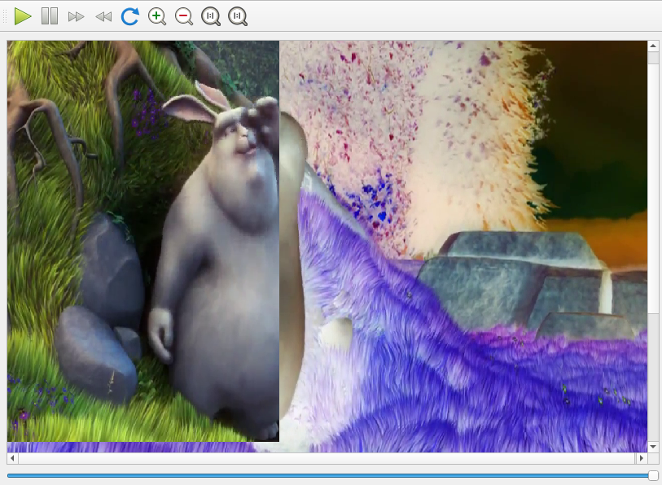

# rvideo
A qt application for compare and annotate video....

#dependency 
LIBS+= -lopencv_core -lopencv_imgproc  -lopencv_videoio
LIBS+= -lavcodec -lavformat -lavdevice -lavutil -lm

and webengine.

# compil

qtcreate rvideo.pro

